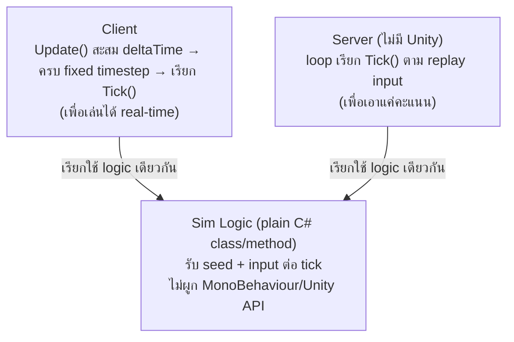
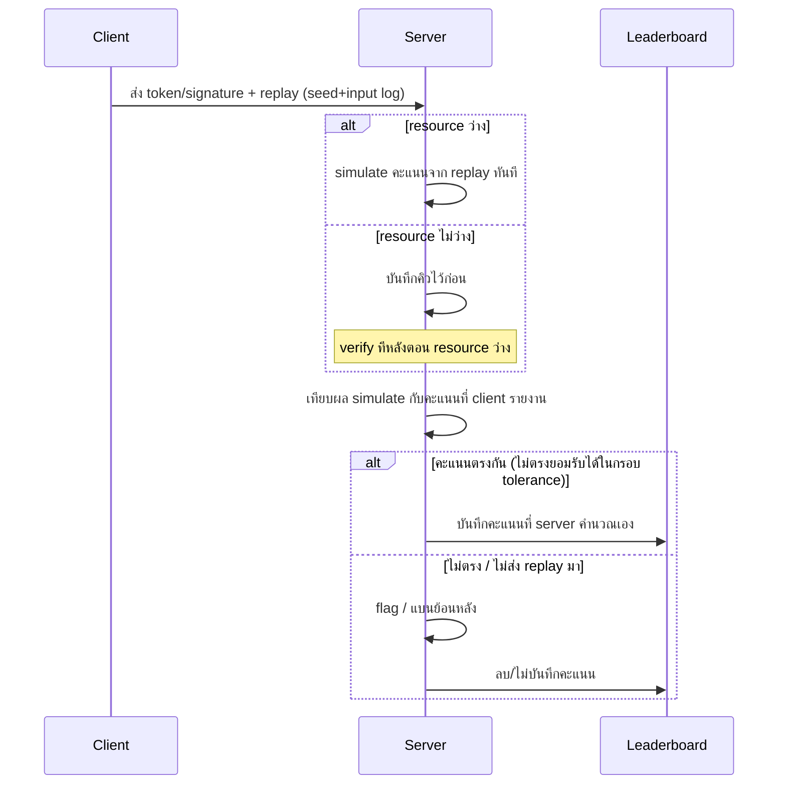

# ส่วนที่ 1 — System Design

## 1.1 Deterministic Simulation

- ทำให้เกม Deterministic ได้อย่างไรบน Unity : ส่วนแสดงผลจะใช้ fixed timestep ร่วมกับ fixedupdate เพื่อให้แสดงผลเหมือนกัน และยังสามารถ simulate ออกมาใหม่ได้ เพราะเราไม่ได้ผูกกับ เวลา เราผูกกับ tick และ random สิ่งกีดขวางนั้น ต้องมี seed ที่เหมือนกัน สำหรับทุกคน เพื่อให้สิ่งกีดขวางขึ้นมาเหมือนเดิมทุกครั้งที่เล่น 
- ปัจจัยที่ทำลาย Determinism + วิธีจัดการแต่ละปัจจัย :

| ปัจจัยที่ทำลาย Determinism | วิธีจัดการ |
|---|---|
| การ random โดยไม่ใช้ seed ทุกครั้งที่เล่นสิ่งกีดขวางจะไม่เหมือนกัน | random โดยใช้ seed |
| การรันทุกอย่างใน update โดยอิง time.deltatime สุดท้ายแล้วมันจะมีความคลาดเคลื่อนเกิดขึ้น ในเครื่องที่ framerate ไม่เท่ากัน | ใช้ fixed update |
| แต่ละฮาร์ดแวร์มีการคำนวนค่า float ที่ต่างกันทำให้ค่า score สุดท้ายมีโอกาสคลาดเคลื่อน | round float จากการคำนวนทุก tick วิธีนี้แก้ไม่ได้ 100% และอาจมีความคลาดเคลื่อนเกิดขึ้นได้ คะแนนสุดท้ายที่จะแสดงจึงต้องมาจาก server เพื่อความแม่นยำอีกขั้น |
- Frame Rate ไม่เท่ากัน (30/60/120 FPS) — รับมืออย่างไร : จากที่อธิบายไปแล้วในเรื่องการใช้ fixed timestep และ fixed update ดังนั้น ในเครื่องที่ framerate ต่ำ บางเฟรม fixed update อาจถูกเรียกหลายรอบ ส่วนเครื่องที่ frame rate สูง บางเฟรม fixed  update อาจไม่ถูกเรียกเลย ทำให้ จำนวนและขนาด tick เท่ากัน ไม่ว่าจะ framerate เท่าไร
- ขอบเขต: อะไรต้อง Deterministic อะไรไม่จำเป็น

| **จำเป็นต้อง Deterministic** | **ไม่จำเป็น** |
|---|---|
| speed, การสุ่ม obstacle, คะแนน | ui, เสียง |
- Simulation ควรอยู่ในรูปแบบใดจึงรันได้ทั้ง Client และ Server : fixed timestep โดย simulate คะแนนออกมาโดยใช้ loop จาก replay input ที่บันทึกไว้ หากต้องการแค่คะแนน แต่หากต้องการเกม replay ฝั่ง client เราสามารถใช้ update ของ unity สะสม delta time ไปเรื่อยพอถึง fixed timestep ก็รัน 1 tick โดย simulate logic จะใช้ script class และ method เดียวกัน หรือ อย่างน้อย อาจไม่ใช่ไฟล์เดียวกัน แต่ต้องเขียน logic ให้เหมือนกัน กรณี server ไม่ได้ใช้ c#

## 1.2 Anti-Cheat & Score Validation

- วิธีที่ทำให้ Server เชื่อถือคะแนนได้ + กันโกงแบบไหนได้/ไม่ได้ : client ต้องส่ง token หรือ signature ระบุตัวตนมาด้วย แต่ server ไม่เชื่อคะแนนจากฝั่ง client อยู่แล้วครับ server จะ simulate คะแนนเองจาก replay input ที่ client ต้องส่งมา ถ้าไม่ส่งมาก็เชื่อได้เลยว่าไม่โปร่งใส สิ่งที่กันได้คือหาก มีการส่ง คะแนนที่ไม่ตรงกับที่ควรจะได้ขึ้นมาก็ไม่สามารถบันทึกได้ แต่จะกันไม่ได้หากสามารถทำสร้าง replay ปลอมขึ้นมาได้ 
- ต้นทุนของแนวทางที่เลือก (ข้อมูลที่ส่ง, CPU ฝั่ง Server, ค่าใช้จ่ายที่โตตามผู้เล่น) : คิดว่าไม่น่าเยอะ เพราะเรารับส่ง กันเป็น text json อาจจะติดตรงเวลาที่ ใช้ ประมวลผลคะแนน
- แนวทางคุ้มค่าที่ระดับแสนคน/วัน — ตรวจทุกคนหรือไม่ ถ้าไม่ เลือกตรวจใครด้วยเกณฑ์ใด : ตรวจทันทีเมื่อ resource ว่างอยู่ ถ้า resource เต็มก็ให้บันทึกไว้ แล้วให้ server รันตรวจทีละคนใน resource ที่ว่างอยู่ในอนาคต แล้วค่อยแบนหรือลบข้อมูลย้อนหลัง เกมจะได้ไหลลื่นไม่เกิดคอขวด
- เน็ตหลุดกลางเกม — ไม่ทำร้ายผู้เล่นสุจริต แต่ไม่เปิดช่องโกง : ถ้ายังอยู่ใน session เดิมแล้วเน็ตสามารถกลับมาต่อได้ ก็ไม่มีปัญหาครับ สามารถ นับถอยหลัก แล้วปล่อยให้เล่นต่อได้เลยแต่จะไม่ยอมให้เข้าเล่นผ่าน session ใหม่เช่นปิดเกมแล้วเปิดใหม่

## 1.3 Scope & Risk

- ความเสี่ยงหลักอย่างน้อย 3 ข้อ + วิธีรับมือ

| ความเสี่ยง | วิธีรับมือ |
|---|---|
| คะแนนที่เกิดจากการโกงส่งข้อมูล อาจขึ้นอยู่ใน leaderboard สักพัก | เริ่มเช็คจาก record อันดับต้นๆก่อนเพื่อคัดกรอง top player ที่โชว์ใน leaderboard ก่อน |
| หากมีการส่งข้อมูลโกงที่เหมือนกับ record จริงทุกอย่างก็อาจจะจับไม่ได้ | ยอมรับความเสี่ยงนี้เพราะคิดว่าไม่คุ้มค่าที่ต้องลงความคิดลงแรงกับจุดนี้ |
| การ resume เกมหลังเน็ตหลุดอาจทำให้เกิดบัค ซึ่งต้องแก้หลายจุด | เพิ่มการ handle ที่ละเอียดมากซึ่งเชื่อมโยงกับหลายระบบเช่น ui , gameplay |
- เวลาลดจาก 3 เดือนเหลือ 6 สัปดาห์ — ตัดอะไรก่อน อะไรตัดไม่ได้เด็ดขาด เพราะอะไร

**สิ่งที่ตัดได้ก่อนเพื่อให้พอกับเวลา**

| ตัดอะไร | เพราะอะไร |
|---|---|
| การ simulate replay ฝั่ง client | สิ่งที่ต้องการคือ record ไม่ใช่ replay |
| การ round การคำนวนค่า float | สุดท้ายก็ใช้ server คำนวนและเชื่อ server |
| ยอมให้เกิดคอขวดระหว่าง verify record | สิ่งที่เกิดขึ้นอาจเป็นแค่ความล่าช้า ไม่ได้ส่งผลอะไรมาก |

**สิ่งที่ตัดไม่ได้**

Deterministic ทั้งหมด และระบบป้องกันการโกง เพราะเป็น requirement หลัก
- จุดที่เลือกทำง่ายกว่าโดยตั้งใจ ทั้งที่มีทาง "ถูกต้องกว่า" ในทางทฤษฎี พร้อมเหตุผล

| **เลือกทำ (ง่ายกว่า)** | **ทางที่ "ถูกต้องกว่า" (ไม่เลือก)** | **เหตุผล** |
|---|---|---|
| round ค่าที่คำนวนได้ทุก tick + ให้ server บันทึกคะแนนที่ส่งมาไปก่อน แล้วค่อยปรับเป็นคะแนนจริงหลังตรวจสอบ | fixed point — แปลงทุกค่าที่คำนวนเป็น int แล้วค่อยเอามาคำนวน | fixed point ยุ่งยากกว่า เพราะต้องแปลงค่าของ gameplay ทั้งระบบและค่าใน Unity เป็น int และต้องมีจุดที่แปลงค่ากลับ สิ่งที่ต้องการจริงๆคือค่าที่เหมือนในทุกเครื่อง ไม่จำเป็นต้องแม่นยำสมบูรณ์แบบ |
| resume ใน session เดิม | resume ข้าม session | การ resume ข้าม session อาจจะดูยุติธรรมกว่าสำหรับผู้เล่นที่หลุด แต่ฝั่งผู้เล่นที่โกงจะกลายเป็นเพิ่มความเสี่ยงให้ตัวเกม หากผู้เล่นแก้ไฟล์ให้ตัวเองเหมือนกับคนที่หลุด |

---

## AI-usage disclosure

**1.1 Deterministic Simulation** — ผมเขียน draft เองก่อน แล้ว AI ช่วยอธิบาย concept ที่ผมไม่แน่ใจ + ชี้จุดที่ตอบไม่ครบ ผมเอาความเข้าใจไปเขียนคำตอบเองทั้งหมด สรุปที่ AI ช่วย:
- ชี้ว่า `deltaTime * speed` แก้แค่การแสดงผล ไม่ใช่ตัวทำให้ deterministic จริง ต้องใช้ fixed-timestep แทน และ sim logic ต้องแยกเป็น plain C# ไม่ผูก MonoBehaviour (server ไม่มี Unity Player)
- อธิบาย float precision ต่างเครื่องคืออะไร ทำไมโจทย์นี้แคร์เป็นพิเศษ (ใช้ replay-verification เป็น anti-cheat) และวิธีรับมือ (round ทุก tick ลด drift ได้แต่ไม่ 100%, fixed-point คือทางที่การันตีได้แต่ต้นทุนสูง)
- แก้ความเข้าใจผิดของผม: เคยคิดว่า "round แล้วเชื่อ client score" พอ — AI ชี้ว่าขัดกับช่องโหว่ client-authoritative score ที่เจอเองใน Part 3 server ต้อง replay คำนวณเองเสมอ
- Review จุดที่ตอบบางไป (Frame Rate ข้อ 3, ความสม่ำเสมอของ list ปัจจัยข้อ 2) ให้ผมเติมเอง
- ข้อ 5 อธิบายว่า client ไม่จำเป็นต้องพึ่ง `FixedUpdate` ตรงๆ ใช้ accumulator เองใน `Update()` ได้ และช่วยแยกจุดประสงค์ server (เอาแค่คะแนน) vs client (ต้องเล่นได้ real-time ด้วย) ที่ผมสับสน — ส่วนประเด็น "ถ้า server ไม่ใช้ C#" เป็นของผมเองที่ต่อยอด

เนื้อหา/ประโยคทั้งหมดในคำตอบเป็นของผมเขียนเอง AI ไม่ได้เขียนคำตอบแทน มีบทบาทแค่อธิบาย concept และชี้จุดที่ตอบไม่ครบ (AI จัดตาราง (รวมตารางขอบเขต) + วาด diagram สถาปัตยกรรม sim class ให้จากที่ผมเขียนไว้แล้ว ไม่ได้เปลี่ยนเนื้อหา)

**1.2 Anti-Cheat & Score Validation** — ผมเขียน draft เอง AI ช่วย review ชี้จุดไม่ครบ/ขัดแย้งกันเอง ผมแก้เองทั้งหมด:
- ข้อ 1 ตอบแค่ "กันไม่ได้" ด้าน AI ชี้ว่าลืมบอกว่า "กันได้" อะไรด้วย ผมเลยเติมส่วนกันคะแนนปลอมได้
- ข้อ 3 ("ตรวจทุกคน") ขัดกับข้อ 2 ที่ผมเองพูดว่า CPU อาจเป็นคอขวด — AI ชี้ความขัดแย้งนี้ ผมแก้เป็นแนวทาง verify async แทน
- ข้อ 4 (เน็ตหลุด) AI ชี้ว่าคำตอบตอนแรก (ไม่บันทึก ต้องเล่นใหม่) ขัดกับโจทย์เองที่บอก "ไม่ทำร้ายผู้เล่นสุจริต" ผมเลือกคงคำตอบนั้นไว้ก่อนโดยระบุว่าเป็นจุดที่ต้องให้ฝ่ายดีไซน์/PM ตัดสินใจ ต่อมาได้ second opinion จาก Fable (ผ่านทีม AI อีกตัว) ชี้ว่า "ให้ design/PM ตัดสินใจ" ไม่ใช่คำตอบที่ยอมรับได้กับคำถามที่โจทย์ถามให้ผมตอบในฐานะวิศวกรเอง ผมเลยกลับมาคิดคำตอบของตัวเองใหม่และเขียนเองทั้งหมด (resume ได้ใน session เดิมที่หลุด แต่ไม่ให้ resume ข้าม session เพื่อกันโกง)

เนื้อหา/ประโยคทั้งหมดเป็นของผมเขียนเอง AI มีบทบาทแค่ชี้จุดขัดแย้ง/ไม่ครบ ไม่ได้เขียนคำตอบแทน (AI วาด sequence diagram สรุป flow จากที่ผมเขียนไว้แล้ว ไม่ได้เพิ่มเนื้อหา/ตัดสินใจ design ใหม่)

**1.3 Scope & Risk** — ผมเขียน draft เอง AI ช่วย review จุดที่ตอบไม่ครบ ผมแก้เองทั้งหมด:
- ข้อความเสี่ยง 2 ข้อหลัง (replay ปลอมจับไม่ได้, เน็ตหลุดตัดจบ) ตอนแรกไม่มีวิธีรับมือเลย AI ชี้ให้เติม ผมเติมเอง — ต่อมาหลังแก้คำตอบเน็ตหลุดใน 1.2 ใหม่ (resume ใน session เดิม) ความเสี่ยงข้อนี้ไม่ตรงกับดีไซน์ใหม่แล้ว ผมเปลี่ยนเป็นความเสี่ยงเรื่องการ resume เองอาจเกิดบัค (ต้อง handle เชื่อมหลายระบบ ui/gameplay) แทน เพื่อให้ครบ 3 ข้อตามโจทย์
- เวลาลด 3 เดือนเหลือ 6 สัปดาห์: AI ชี้ว่าข้อ "ตัด replay ฝั่ง client" กำกวมไม่รู้หมายถึงอะไร ผมชี้แจงเอง และ AI ชี้ว่าขาดฝั่ง "ตัดไม่ได้เด็ดขาด" ไปทั้งฝั่ง ผมเติมเอง
- ข้อสุดท้าย (จุดที่เลือกง่ายกว่าโดยตั้งใจ) ผมถาม AI เรื่อง fixed-point math หลายรอบเพราะไม่เข้าใจ: คืออะไร, ทำไม `x1000` ถึงการันตี deterministic ได้ (ต่างจาก float ตรงไหน), และวิธีทำ growth แบบ % โดยไม่หลุดกลับไปเป็น float (คูณ-หารด้วย scaled-integer) — ผมเคยเข้าใจผิดว่า fixed-point "ทำยาก" ในแง่เทคนิคเดี่ยวๆ AI ช่วยปรับมุมมองว่าต้นทุนจริงคือต้องทำทั่วทั้งระบบ + จุดต่อกับ Unity (float-native) ไม่ใช่ตัวเทคนิคเอง ผมเอาความเข้าใจนี้ไปเขียนเหตุผลเปรียบเทียบ round vs fixed-point เอง
- AI จัดรายการความเสี่ยง, ตัดอะไรตอนเวลาลด, และจุดที่เลือกง่ายกว่า ให้เป็นตาราง จากที่ผมเขียนไว้แล้วทั้งหมด ไม่ได้เปลี่ยนเนื้อหา

เนื้อหา/ประโยคทั้งหมดเป็นของผมเขียนเอง AI ไม่ได้เขียนคำตอบแทน มีบทบาทแค่อธิบาย concept ที่ถามและชี้จุดที่ตอบไม่ครบ